# Learn how to provision a cluster of Oracle Integration with Load-Balancer and OCI API Gateway

## Introduction

Oracle Integration is an enterprise connectivity and automation platform for quickly modernizing applications, business processes, APIs, and data. Developers and business IT teams can connect any SaaS and on-premises applications six times faster with a visual development experience, embedded best practices, and prebuilt integrations for Salesforce, Snowflake, Workday, and more.

OIC has a limit of 60K messages per hour per instance. You can define the maximum of 12 packages when creating a instance. So how to scale this limitation?

In this article, you can see how to distribute the requests through a load-balancer with a cluster of OICs (up to 16 instances).

The answer for this approach is using an OCI API Gateway in front of each OIC instance. This is necessary because you cannot specify the OIC IP addresses in backend configuration of the Load-Balancer and request the path through your integrations. 

With OCI API Gateway, you can configure the path for OIC and link with the backend configuration in the Load-Balancer. It will work, the balancing will distribute the requests like a single request direct to the OIC endpoint.

Let's go!

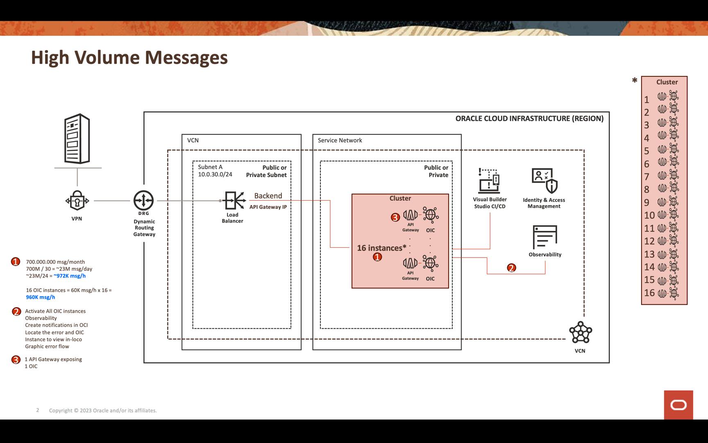

## Objectives

- Scale OIC up to the maximum of 60K messages/hour using many instances of OIC
- Configure the components to clusterize the OIC: Load-Balancer, OCI API Gateway and DNS Zone

## Prerequisites

To clusterize the OIC using Load-Balancer and OCI API Gateway, you need to:

- Knowledge to provision and configure the OIC's instances
- Knowledge to provision and configure  OCI API Gateways
- Knowledge to provision and configure Load-Balancer
- Knowledge to configure DNS Zone and Network resources

## Task 1: Create the OICs instances

In this article, we will show how to configure up to 16 OIC's instances. This will reach up to 960K messages/hour (60K x 16).
You need to create the number of instances that reach your messages/hour target. So, for example, if you need 480K messages/hour:

    Your_target / Maximum_messages_per_instance = Number_of_instances
    480K / 60K = 8 instances
    480K = your messages/hour target
    60k = maximum messages/hour limit per instance

If you don't know how to create an OIC instance, you can follow this steps in the official documentation:

[Create an Oracle Integration Instance](https://docs.oracle.com/en/cloud/paas/integration-cloud/integration-cloud-auton/create-oracle-integration-cloud-instance.html#GUID-F6F5341D-8E36-43A8-BCB4-3FF5E8BE8E5A)

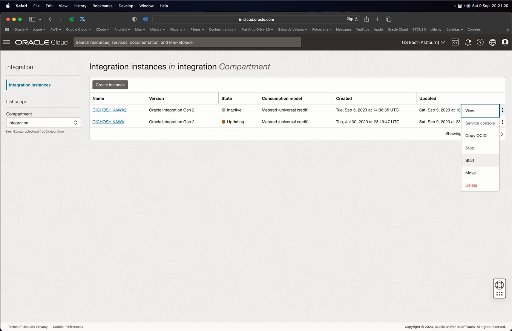

## Task 2: Create an OCI API Gateway for each OIC Instance

Now, we need to create one OCI API Gateway for each OIC Instance. This is mandatory because each API Gateway IP will be mapped in the Load-Balancer backend configuration and each API Gateway deployment will point into OIC endpoint.

If you don't know how to create an API Gateway instance, you can follow this steps in the official documentation:

[Create an API Gateway](https://docs.oracle.com/en-us/iaas/Content/APIGateway/Tasks/apigatewaycreatinggateway.htm)

In the OCI API Gateway, you need to deploy an API following this steps (view the picture to see the configuration):

    1. Create 1 API Gateway for 1 OIC Instance
    2. For each API Gateway, create 1 deployment for the corresponding OIC Instance
    3. You don't need to configure security in API Gateway, the default security will be the OIC
    
    API Paramters
    - Path Prefix: /ic
    - Path: /api/integration/{myIntegrations*}
    - Methods: ANY
    - HTTP: https://oic-xxxxxxxxxxxxxx.integration.ocp.oraclecloud.com/ic/api/integration/${request.path[myIntegrations]}
    
    oic-xxxxxxxxxxxxxx.integration.ocp.oraclecloud.com = Corresponding OIC endpoint for each OCI API Gateway deployment

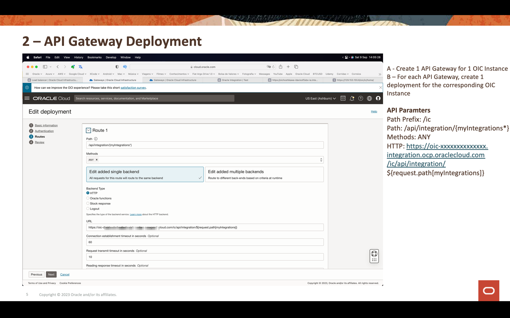

Do this configuration for each OIC API Gateway.

## Task 3: Create and Configure the Load-Balancer

After create the OICs and API GAteways instances, you can create the Load-Balancer to distribute the requests through the cluster.
Prepare you VCN and subnet before the Load-Balancer creation.

If you don't know how to create a Load-Balancer instance, you can follow this steps in the official documentation:

[Creating a Load-Balancer](https://docs.oracle.com/en-us/iaas/Content/Balance/Tasks/managingloadbalancer_topic-Creating_Load_Balancers.htm)

    Select if your Load-Balancer will be Public or Private
    Configure the VCN and subnet

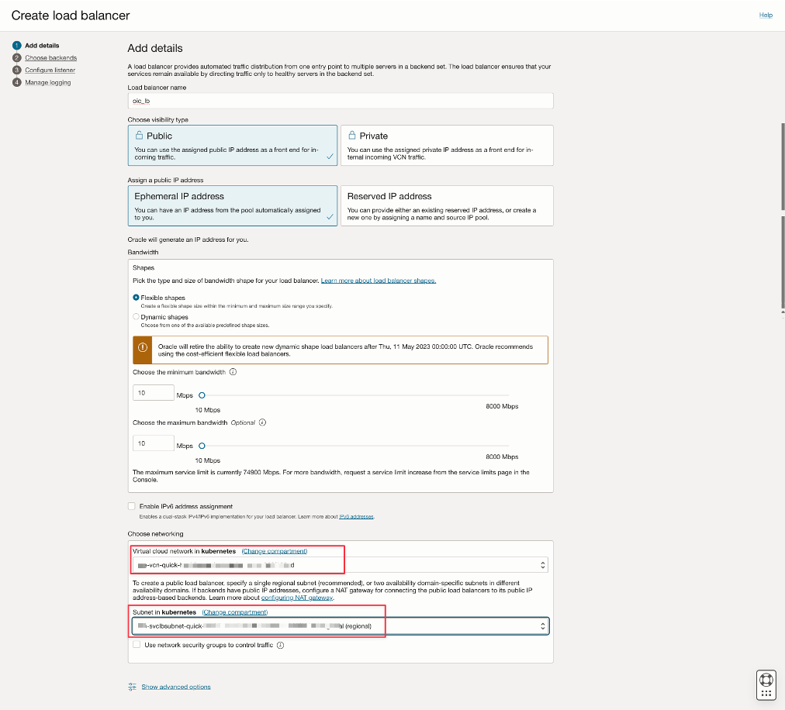

    Select the policy for you load-balancing
    Specify the TCP protocol and the 443 port (OIC and API Gateway works with this configuration)

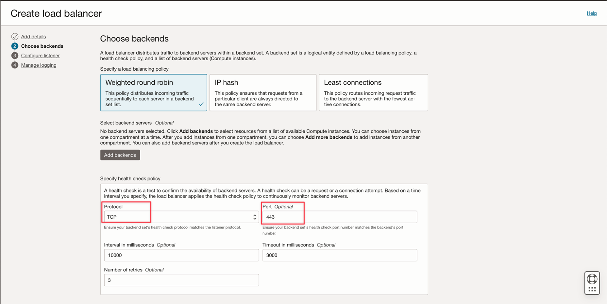

    Configure the listener with TCP and port 443 

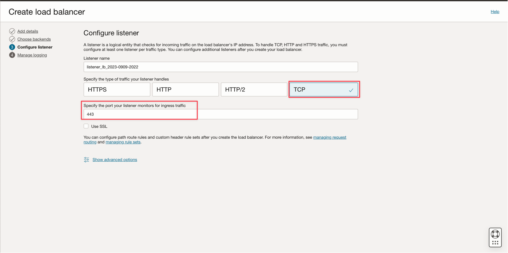

    With the Load-Balancer created, let's configure the Backend.
    Select your backend configuration and add the IP for each API Gateways instances

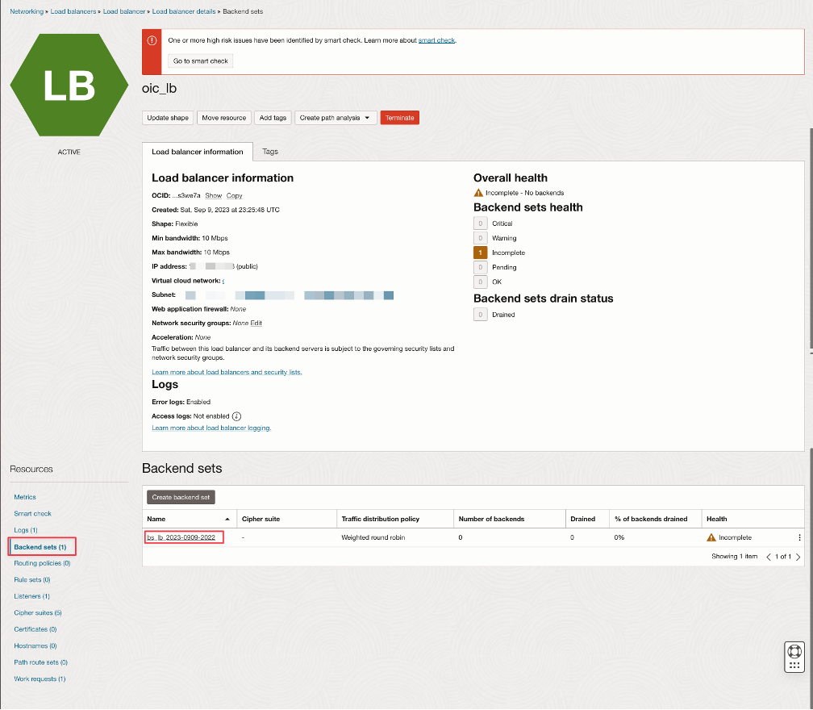
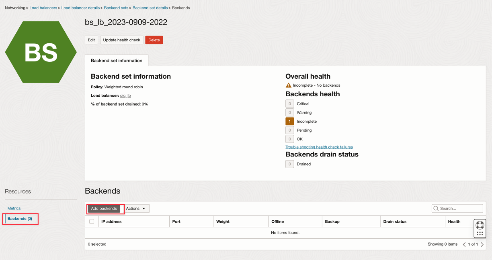
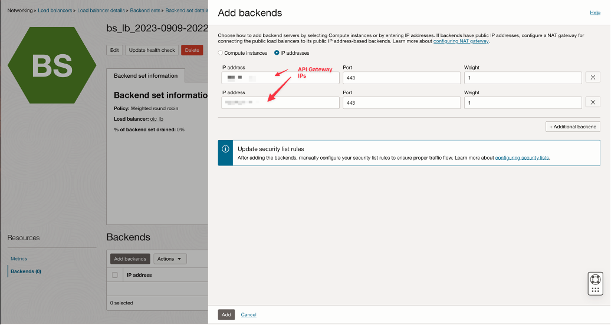

## Task 4: Configure the DNS Zone for the Load-Balancer

Configure a DNS name for you Load-Balancer putting the load-balancer IP address into the DNS Zone.
See [Configure Zones](https://docs.oracle.com/en-us/iaas/Content/DNS/Tasks/managingdnszones.htm)

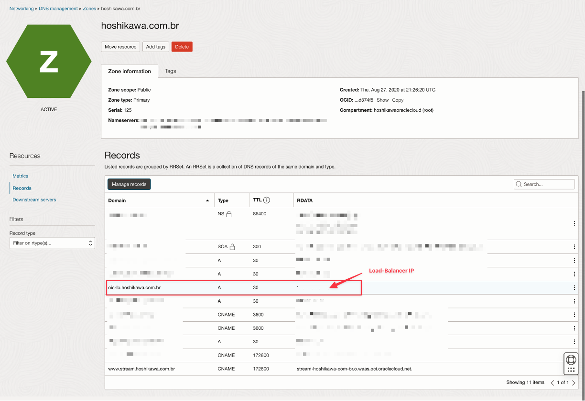

## Task 5: Configure the OIC's Allow-List and the Subnet Nat-Gateway  

You need to configure the Load-Balancer's Subnet with the Route Table's IPs. Without this configuration, the communication between OICs and the API Gateways will not complete.
So, you need to create in your VCN a Nat Gateway and configure, for each API Gateway, one route table using Nat Gateway and put the API Gateway IP address with /32.

To guarantee the security of each OIC instance, you need to configure an Allow-List putting the corresponding API Gateway IP there.
This configuration will say the OIC will only accepts connection with the corresponding API Gateway.

For each OIC instance, do this configuration:

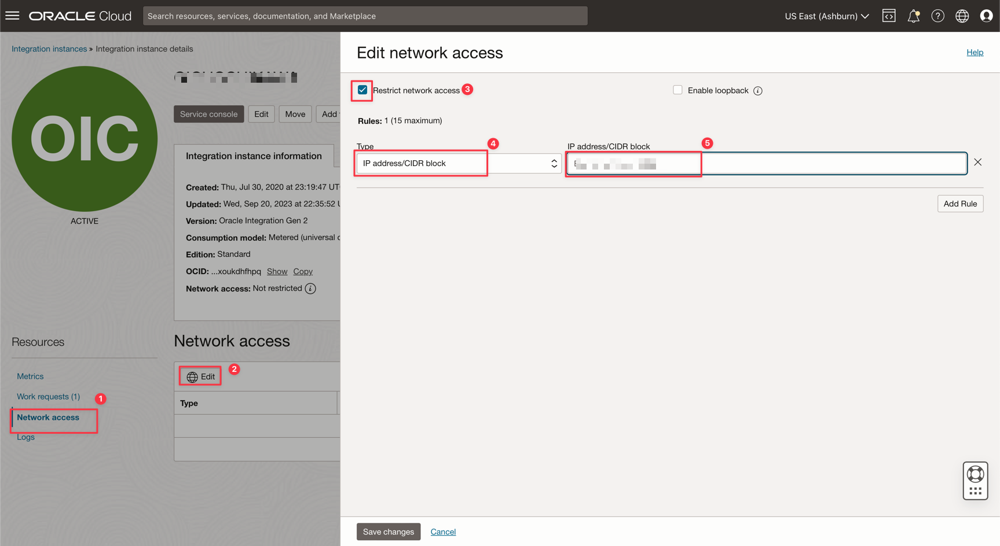

## Task 6: Test the Solution

You can construct a bash script to CURL the OIC integration to test the balancing.
In this example, the script will call 100 times the integration through the load-balance.
You can see the balancing on the OICs monitoring track instances.

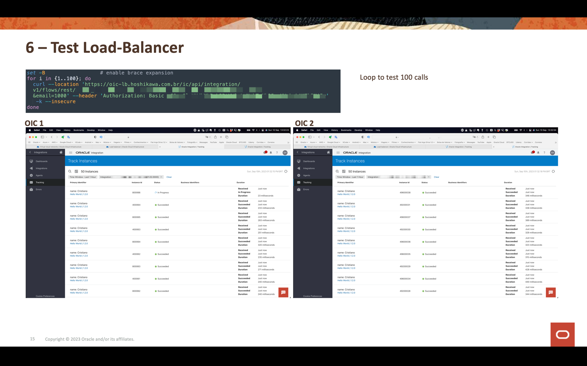

    set -B
    for i in {1..10}; do
        curl -s -k 'GET' -H 'header info' -b 'stuff' 'http://example.com/id='$i
    done

## Final Considerations

Deploy the integration on each OIC instance. An error should occur if the integration does not exist in the OIC instance if the load-balancer selects the same one.

Do not execute an integration request from an OIC instance to another specific instance. Always execute a local integration from the same OIC instance and replicate this integration into another instances.

If you configure this OIC Cluster to scale, remember that your backends need to scale too.

You can create more than one Cluster of OIC. For example, you can configure specifics clusters segregated by project.
But you need to isolate this with different Load-Balancers.
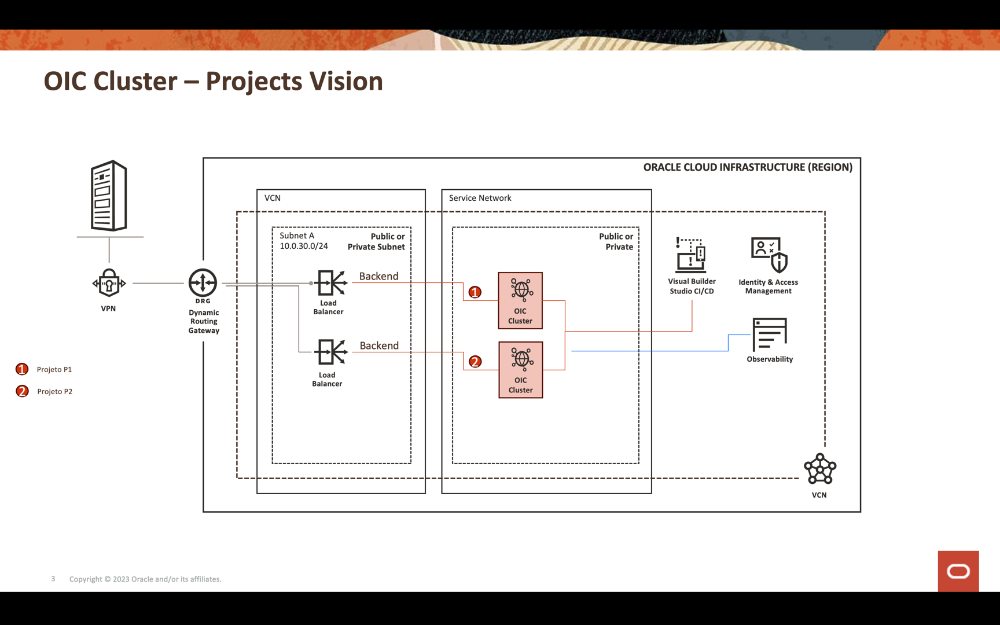

## Related Links

* [Create an Oracle Integration Instance](https://docs.oracle.com/en/cloud/paas/integration-cloud/integration-cloud-auton/create-oracle-integration-cloud-instance.html#GUID-F6F5341D-8E36-43A8-BCB4-3FF5E8BE8E5A)
* [Create an API Gateway](https://docs.oracle.com/en-us/iaas/Content/APIGateway/Tasks/apigatewaycreatinggateway.htm)
* [Creating a Load-Balancer](https://docs.oracle.com/en-us/iaas/Content/Balance/Tasks/managingloadbalancer_topic-Creating_Load_Balancers.htm)
* [Configure Zones](https://docs.oracle.com/en-us/iaas/Content/DNS/Tasks/managingdnszones.htm)

## Acknowledgments

* **Authors** - Cristiano Hoshikawa (Oracle LAD A-Team Solution Engineer) and Rodrigo Chafik (Oracle LAD A-Team Solution Engineer) 

