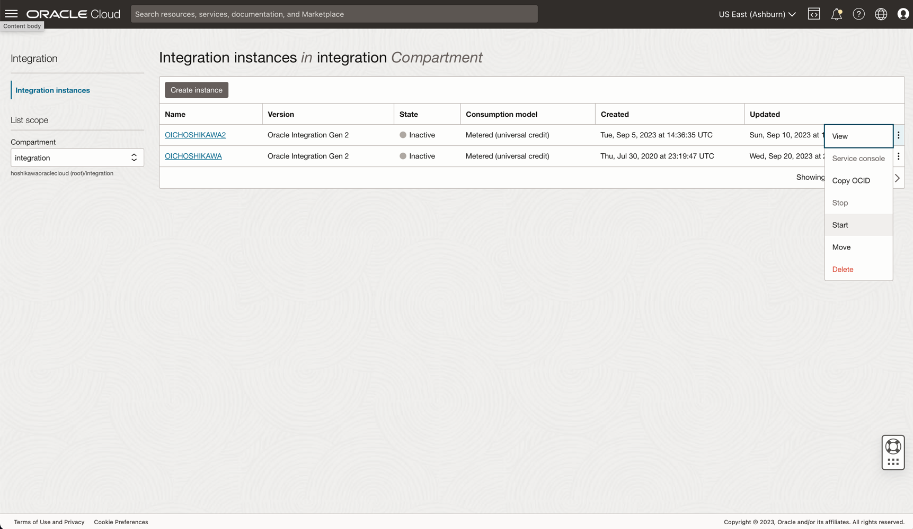
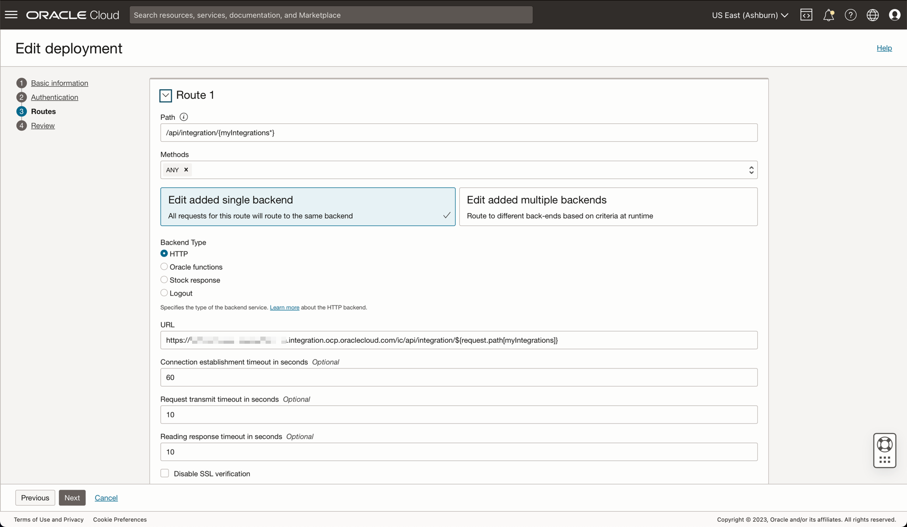
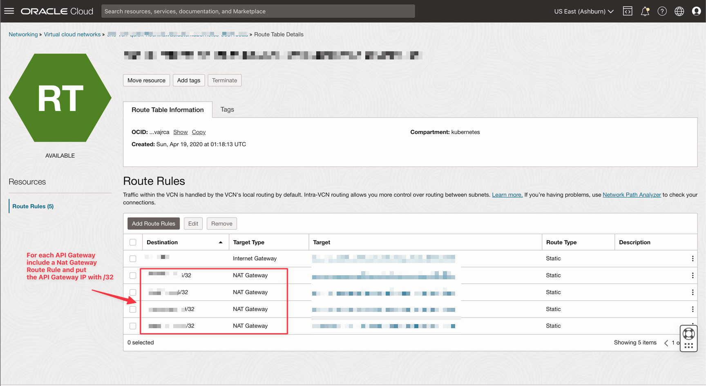

# Provision an Oracle Integration Cluster with Load Balancer and Oracle API Gateway

## Introduction

Oracle Integration is an enterprise connectivity and automation platform designed to quickly modernize applications, business processes, APIs, and data. Developers and business IT teams can connect to any SaaS and on-premises applications six times faster using a visual development experience, embedded best practices, and prebuilt integrations for Salesforce, Snowflake, Workday, and more.

Oracle Integration has a limit of 60K messages per hour per instance. You can define a maximum of 12 packages when you create an instance.

In this tutorial, learn how to distribute the requests through a Load Balancer with an Oracle Integration cluster (up to 16 instances).

To scale this limitation, use an Oracle API Gateway in front of each Oracle Integration instance. This is necessary because you cannot specify the Oracle Integration IP addresses in the backend configuration of the Load Balancer and request the path through your integrations.

With Oracle API Gateway, configure the path for Oracle Integration and link with the backend configuration in the Load Balancer. The balancing will distribute the requests, treating them as a single request directed to the Oracle Integration endpoint.

### Objectives

- Scale Oracle Integration up to the maximum of 60K messages/hour using multiple instances of Oracle Integration

- Configure the components to clusterize Oracle Integration: Load Balancer, Oracle API Gateway and DNS Zone

### Prerequisites

You must have an understanding of how to:

- Provision and configure Oracle Integration instances
- Provision and configure Oracle API Gateways
- Provision and configure Load Balancer
- Configure DNS Zone and network resources

## Considerations

- Remember to maintain the same base configuration for Oracle API Gateway and Oracle Integration. So create these instances in the same compartments, with same security and any other configuration that affects the properly working routine.

- Deploy the integration on each Oracle Integration instance. An error should occur if the integration does not exist in the Oracle Integration instance if the Load Balancer selects the same one.

- Do not execute an integration request from an Oracle Integration instance to another specific instance. Always execute a local integration from the same Oracle Integration instance and replicate this integration into other instances.

- If you configure this Oracle Integration Cluster to scale, remember that your backends need to scale too.

- You can create more than one cluster of Oracle Integration. For example, you can configure specific clusters segregated by project. However, you need to isolate this with different Load Balancers.

- You can configure up to 16 API Gateway + Oracle Integration per Load Balancer. Each Load Balancer supports 16 backends.

- In CI/CD, remember you need to deploy the same artifact (integration) over the 16 Oracle Integrations.

- To debug a clusterized Oracle Integration, first activate the Oracle Cloud Infrastructure (OCI) Observability on each Oracle Integration instance of your cluster. [Capture the Activity Stream of Integrations in Oracle Cloud Infrastructure Console](https://docs.oracle.com/en/cloud/paas/integration-cloud/oracle-integration-oci/capture-activity-stream-oracle-cloud-infrastructure-console.html#GUID-0E99AF18-2B20-4BC4-8174-9BE5A84945DE). To debug a cluster, you need to search the problem in OCI Observability, discover the Oracle Integration instance where the error occurred and then go to the Oracle Integration instance and view the Tracker Instances console.

## Task 1: Create the Oracle Integration instances

In this task, you will get to learn how to configure up to 16 Oracle Integration instances. This will reach up to 960K messages/hour (60K x 16).

You need to create the number of instances that reach your messages/hour target. So, for example, if you need 480K messages/hour:

    Your_target / Maximum_messages_per_instance = Number_of_instances
    480K / 60K = 8 instances
    480K = your messages/hour target
    60k = maximum messages/hour limit per instance

To create an Oracle Integration instance, follow this official documentation [Create an Oracle Integration Instance](https://docs.oracle.com/en/cloud/paas/integration-cloud/integration-cloud-auton/create-oracle-integration-cloud-instance.html#GUID-F6F5341D-8E36-43A8-BCB4-3FF5E8BE8E5A) .

## Task 2: Create an Oracle API Gateway for each Oracle Integration Instance

Create Oracle API Gateway for each Oracle Integration Instance. This is mandatory because each Oracle API Gateway IP will be mapped in the Load Balancer backend configuration and each Oracle API Gateway deployment will point to the Oracle Integration endpoint.

To create an Oracle API Gateway instance, follow this official documentation [Create an API Gateway](https://docs.oracle.com/en-us/iaas/Content/APIGateway/Tasks/apigatewaycreatinggateway.htm).

In the Oracle API Gateway, deploy an API using these steps:

    1. Create 1 Oracle API Gateway for 1 Oracle Integration Instance.

    2. For each Oracle API Gateway, create 1 deployment for the corresponding Oracle Integration Instance.

    3. You don't need to configure security in Oracle API Gateway, the default security will be the Oracle Integration.

        API Parameters
        - Path Prefix: /ic
        - Path: /api/integration/{myIntegrations*}
        - Methods: ANY
        - HTTP: https://oic-xxxxxxxxxxxxxx.integration.ocp.oraclecloud.com/ic/api/integration/${request.path[myIntegrations]}, where oic-xxxxxxxxxxxxxx.integration.ocp.oraclecloud.com = Corresponding Oracle Integration endpoint for each Oracle API Gateway deployment

>**Note**: Complete this configuration for each Oracle API Gateway.

## Task 3: Create and Configure the Load Balancer

After creating the Oracle Integration and Oracle API Gateway instances, create the Load Balancer to distribute requests through the cluster. Prepare your VCN and subnet before the Load Balancer creation.

To create a Load Balancer instance, follow this official documentation [Creating a Load-Balancer](https://docs.oracle.com/en-us/iaas/Content/Balance/Tasks/managingloadbalancer_topic-Creating_Load_Balancers.htm).

1.  Select if your Load-Balancer will be Public or Private.

2.  Configure the VCN and subnet.

    

3.  Select the load balancing policy.

4.  Specify the TCP protocol and the 443 port (Oracle Integration and API Gateway works with this configuration).

    

5.  Configure the listener with TCP and port 443.

    

6.  With the Load Balancer created, configure the Backend. Select your backend configuration and add the IP for each Oracle API Gateway instance.

    
    
    

## Task 4: Configure the DNS Zone for the Load Balancer

Configure a DNS name for your Load Balancer by providing the load balancer IP address in the DNS Zone. For more details, see [Configure Zones](https://docs.oracle.com/en-us/iaas/Content/DNS/Tasks/managingdnszones.htm).

## Task 5: Configure Oracle Integration Allow-List and Subnet NAT Gateway

You must configure the Load Balancer's Subnet with the Route Table's IPs. Without this configuration, the communication between Oracle Integration and the Oracle API Gateway will not work.

So, you must create a NAT Gateway in your VCN and configure, for each Oracle API Gateway, one route table using NAT Gateway and add the API Gateway IP address with /32.

To guarantee the security of each Oracle Integration instance, you need to configure an Allow-List by providing the corresponding API Gateway IP. This configuration will specify that Oracle Integration will only accept connection with the corresponding API Gateway.

For each Oracle Integration instance, follow this configuration:

## Task 6: Test the Solution

You can construct a bash script to CURL the Oracle Integration to test the balancing.
In this example, the script will call the integration 100 times through the load balancer.
You can see the balancing on the Oracle Integrations monitoring track instances.

**Code for test**

**OIC 1**

**OIC 2**

    set -B
    for i in {1..10}; do
        curl -s -k 'GET' -H 'header info' -b 'stuff' 'http://example.com/id='$i
    done

## Related Links

- [Create an Oracle Integration Instance](https://docs.oracle.com/en/cloud/paas/integration-cloud/integration-cloud-auton/create-oracle-integration-cloud-instance.html#GUID-F6F5341D-8E36-43A8-BCB4-3FF5E8BE8E5A)

- [Create an API Gateway](https://docs.oracle.com/en-us/iaas/Content/APIGateway/Tasks/apigatewaycreatinggateway.htm)

- [Create a Load Balancer](https://docs.oracle.com/en-us/iaas/Content/Balance/Tasks/managingloadbalancer_topic-Creating_Load_Balancers.htm)

- [Configure Zones](https://docs.oracle.com/en-us/iaas/Content/DNS/Tasks/managingdnszones.htm)

- [Capture the Activity Stream of Integrations in Oracle Cloud Infrastructure Console](https://docs.oracle.com/en/cloud/paas/integration-cloud/oracle-integration-oci/capture-activity-stream-oracle-cloud-infrastructure-console.html#GUID-0E99AF18-2B20-4BC4-8174-9BE5A84945DE)

## Acknowledgments

- **Authors** - Cristiano Hoshikawa (Oracle LAD A-Team Solution Engineer) and Rodrigo Chafik Choueiri (Oracle LAD A-Team Solution Engineer)
